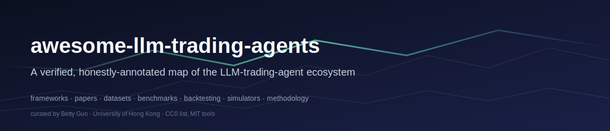

<!-- DO NOT EDIT — generated from entries/ by tools/build_readme.py. See CONTRIBUTING.md. -->

  

# awesome-llm-trading-agents

> A curated, verified map of the LLM-trading-agent ecosystem — frameworks, papers, datasets, and evaluation tools — with honest notes on what is rigorous and what is hype.

  

---

## ⚠️ Not financial advice

This list is a research map. Nothing here is investment advice. The category is full of projects with attractive backtests that do not survive contact with live markets. **Read [`docs/methodology.md`](docs/methodology.md) before trusting any backtest you see in any project on this list.**

---

## What is in / out of scope

**In scope:** LLM-powered trading agents (multi-agent and single-agent), the papers that ground them, the datasets they consume, the benchmarks they're evaluated on, the backtesting / execution / market-simulation tooling around them, and a teaching section on how to critically evaluate any such system.

**Out of scope:** Generic AI-in-finance, generic LLM agents, general FinLLMs as language models without a decision-making focus, and the broader quant ecosystem. The closest neighbouring lists are linked in **Related Lists** below.

---

## Contents

- [Multi-Agent LLM Trading Frameworks](#multi-agent-llm-trading-frameworks)
- [Single-Agent & Memory-Augmented LLM Traders](#single-agent-memory-augmented-llm-traders)
- [Foundational & Influential Papers](#foundational-influential-papers)
- [Financial Datasets](#financial-datasets)
- [Benchmarks & Evaluations](#benchmarks-evaluations)
- [Backtesting & Execution Infrastructure](#backtesting-execution-infrastructure)
- [Market-Simulation Environments](#market-simulation-environments)
- [Related Lists](#related-lists)
- [Methodology & Common Pitfalls](docs/methodology.md)
- [Contributing](CONTRIBUTING.md)
- [Curator & License](#curator--license)

---

## Multi-Agent LLM Trading Frameworks

End-to-end LLM-agent systems for trading or investment decisions. The 73k-star anchor of the field lives here.

| Project / Paper | Type | Year / Stars | What it is | Honest note |
|---|---|---|---|---|
| [FinGPT](https://github.com/AI4Finance-Foundation/FinGPT) | framework | 2023 | Open-source financial LLM stack from AI4Finance Foundation. The FinGPT v3 series fine-tunes Llama-2 (7B/13B) and ChatGLM2 (6B) via LoRA on news and tweet sentiment data, packaged with the FinNLP pipeline for finance-specific fine-tuning. | Better understood as a *FinLLM toolkit* than a trading agent — FinGPT itself is a fine-tuned LM used downstream by FinRobot and others, not a standalone trading system. Listed in this section because the LLM-trading-agent stack often starts here for sentiment scoring. The widely-quoted "~$300 fine-tuning cost" applies to LoRA tuning on small data — not to building a competitive general FinLLM from scratch. |
| [TradingAgents](https://github.com/TauricResearch/TradingAgents) · [paper](https://arxiv.org/abs/2412.20138) | framework | 2024 / 73.7k★ (2026-05) | Multi-agent LLM trading framework with specialised fundamental, sentiment, and technical analysts, bull/bear researchers, a trader, and a risk-management team, coordinated via LangGraph and supporting OpenAI, Anthropic, Google, xAI, DeepSeek, Qwen, GLM, MiniMax, OpenRouter, Ollama, and Azure OpenAI backends. | The anchor project of the category. The paper (arXiv 2412.20138) reports improvements in cumulative returns, Sharpe ratio, and maximum drawdown over baselines on a stock-trading task; results, ablations, and the agent debate protocol are documented across versions v1–v7. As with any 2024–25 LLM trading study, readers should independently check whether the evaluation window post-dates the LLM's training cutoff (a known source of look-ahead bias for LLM agents) and how transaction costs are modelled. |
| [QuantAgent](https://github.com/Y-Research-SBU/QuantAgent) | framework | 2025 | Multi-agent LLM framework targeting high-frequency trading, decomposing the task across four specialised agents — Indicator, Pattern, Trend, and Risk — that reason over generated chart images, so a vision-capable LLM is required. | Distinct from TradingAgents in its HFT framing and in being explicitly chart-image-driven. As with any HFT-flavoured LLM agent, readers should pay close attention to claimed bar resolution vs. realistic inference latency: visual-input LLMs are slow relative to HFT decision horizons, so the framework is better read as a research prototype than a deployable HFT stack. |
| [FinRobot](https://github.com/AI4Finance-Foundation/FinRobot) | framework | 2024 | Open-source AI-agent platform from AI4Finance Foundation for financial applications, combining LLMs, reinforcement learning, and quantitative analytics across forecasting, document-analysis, and trading-strategy agents, with financial chain-of-thought prompting throughout. | Platform-style sibling to FinGPT — broader scope than a single trading agent. Strongest signal of activity is the AI4Finance Foundation maintenance footprint (same group behind FinRL and FinGPT). Readers evaluating it for trading specifically should check whether the trading-strategy agent has an end-to-end backtest example, since the platform's breadth makes it easy to miss what is fully implemented vs. scaffolded. |
| [StockAgent](https://github.com/MingyuJ666/Stockagent) | framework | 2024 | Multi-agent LLM system that simulates investor trading behavior in a constructed market environment rather than backtesting against historical price tapes — designed for studying how external factors (news, policy, sentiment shocks) propagate through agent populations. | The contribution is *behavioural*, not predictive: StockAgent is a sandbox for studying agent populations under perturbation, not an LLM that beats buy-and-hold. Readers should treat the simulated-market caveat seriously — results in the paper describe dynamics inside a constructed environment and do not constitute a backtest in the conventional sense. |

## Single-Agent & Memory-Augmented LLM Traders

Single-LLM or memory-augmented traders that don't coordinate a team of agents. Often the cleanest substrate for ablation studies.

| Project / Paper | Type | Year / Stars | What it is | Honest note |
|---|---|---|---|---|
| [FinMem](https://github.com/pipiku915/FinMem-LLM-StockTrading) · [paper](https://arxiv.org/abs/2311.13743) | framework | 2023 | Single LLM trading agent with three modules — character profiling, a layered memory with decay to model differing temporal sensitivities of financial signals, and a decision module — designed to mirror the cognitive structure of human discretionary traders. | Foundational reference for memory-aware LLM traders and the conceptual ancestor of TradingAgents and FinCon. The paper reports strong returns vs. algorithmic baselines on a scoped stock-trading task; readers should note the universe and time window are limited, and like all 2023-vintage LLM trading work the evaluation window risks overlap with the backbone LLM's training data. |
| [Qlib](https://github.com/microsoft/qlib) | framework | 2020 | AI-oriented quantitative investment platform covering the full ML pipeline — data processing, feature engineering, model training, backtesting — across supervised learning, market-dynamics modeling, and reinforcement learning, with the RD-Agent extension automating research workflow. | Like FinRL, not an LLM trading agent but essential infrastructure that LLM-agent work should be benchmarked against. Qlib's data layer (Alpha 158 / 360, point-in-time fundamentals) is among the cleaner public substrates for reproducible factor research and rules out the "the LLM picked up features the baseline didn't have" failure mode. |
| [Fin-R1](https://github.com/SUFE-AIFLM-Lab/Fin-R1) · [paper](https://arxiv.org/abs/2503.16252) | framework | 2025 | A 7B financial reasoning LLM built on Qwen2.5-7B-Instruct, trained with SFT on Fin-R1-Data (~60k bilingual financial reasoning examples) followed by RL with Group Relative Policy Optimization (GRPO). | Important caveat — Fin-R1 is a financial *reasoning* LLM, not a trading agent. The paper reports top scores on FinQA (76.0) and ConvFinQA (85.0), out-performing DeepSeek-R1 and Qwen-2.5-32B on those benchmarks. Useful as a backbone *inside* a trading agent, but on its own it answers financial-reasoning questions; it does not place trades. Treat performance comparisons against trading-agent frameworks as a category error. |
| [FinRL](https://github.com/AI4Finance-Foundation/FinRL) · [paper](https://arxiv.org/abs/2011.09607) | framework | 2020 | Open-source deep reinforcement learning library for automated stock trading, providing a layered architecture (environment, agents, applications) and reference implementations across single-stock, multi-stock, portfolio-allocation, and crypto tasks. FinRL-X is the next-generation modular evolution. | Not an LLM agent — but listed here because *every* LLM-trading paper worth reading should compare to a strong RL baseline, and FinRL is the standard. Use it as the "is this LLM agent actually beating a tuned PPO/SAC on the same task?" sanity check. Readers should note that FinRL itself has many tutorials with optimistic-looking returns; the same critical-reading rules apply. |

## Foundational & Influential Papers

Foundational papers, surveys, and recent work on the methodology, biases, and limits of LLM trading systems.

| Project / Paper | Type | Year / Stars | What it is | Honest note |
|---|---|---|---|---|
| [A Fast and Effective Solution to the Problem of Look-ahead Bias in LLMs](https://arxiv.org/abs/2512.06607) | paper | 2025 | Companion to the look-ahead-bias test paper — proposes a practical method for mitigating look-ahead bias when using pre-trained LLMs in financial backtests without prohibitively expensive re-training of frontier models from scratch. | Complementary to 2512.23847. If you build an LLM trading agent, you need a defensible answer to "why isn't this just memorising 2022–2024 returns?". This paper gives you one practical answer and a vocabulary to discuss it. |
| [A Test of Lookahead Bias in LLM Forecasts](https://arxiv.org/abs/2512.23847) | paper | 2025 | Proposes a test (LAP test) for whether LLMs' apparent predictive power on financial outcomes is inference or memorisation, applied to news-headline-→-return and earnings-call-→-capex tasks. | Required reading before believing any LLM-trading backtest. The paper finds that LLMs' "predictive power" partly reflects memorisation of training-window outcomes rather than genuine forward inference. The implication for every entry in this list: a backtest whose window overlaps the backbone LLM's training cutoff is at minimum suspect. |
| [Can LLM-based Financial Investing Strategies Outperform the Market in Long Run?](https://arxiv.org/abs/2505.07078) | paper | 2025 | Empirical study testing whether LLM-driven investment strategies sustain returns over long evaluation windows — the regime where transaction costs, regime change, and overfitting most often kill backtest-only strategies. | Useful complement to the look-ahead-bias literature: even if you control for training-cutoff bleed, long-run live (or long-window walk-forward) performance is where most LLM strategies reveal their fragility. Read together with López de Prado's *Probability of Backtest Overfitting*. |
| [The Deflated Sharpe Ratio: Correcting for Selection Bias, Backtest Overfitting and Non-Normality](https://papers.ssrn.com/sol3/papers.cfm?abstract_id=2460551) | paper | 2014 | Introduces the Deflated Sharpe Ratio (DSR), which adjusts the conventional Sharpe ratio for the number of trials performed during strategy selection and for non-normal return distributions — separating likely-real edges from artifacts of multiple testing. | The companion to *The Probability of Backtest Overfitting*. If a paper or repo on this list reports a Sharpe of 2 without telling you how many variants were tried before reporting it, the unadjusted Sharpe is almost meaningless. Insist on DSR (or at minimum, the trial count). |
| [The Probability of Backtest Overfitting](https://papers.ssrn.com/sol3/papers.cfm?abstract_id=2326253) | paper | 2014 | Foundational paper formalising "backtest overfitting" — when, in an exhaustive search over trading-strategy variants, the in-sample "best" strategy almost certainly performs poorly out-of-sample. Introduces the Probability of Backtest Overfitting (PBO) statistic. | Pre-LLM but absolutely essential. Every "I tried N variants of my LLM-agent prompt and reported the best Sharpe" workflow is exactly what this paper warns against. If you read one methodology paper before evaluating any project on this list, read this one. |
| [AlphaAgents: LLM-based Multi-Agents for Equity Portfolio Construction](https://arxiv.org/abs/2508.11152) | paper | 2025 | Multi-agent LLM framework for equity portfolio construction that orchestrates specialised agents reasoning over market data and fundamentals via collaborative debate, rather than a single agent with a long context. | Targets *portfolio construction* — a separate problem from single-stock timing and one where the literature has historically been thinner. Compares to standard portfolio baselines; the readability of the debate transcripts is one of the contribution claims and is worth inspecting directly. |
| [FinCon: A Synthesized LLM Multi-Agent System with Conceptual Verbal Reinforcement](https://arxiv.org/abs/2407.06567) | paper | 2024 | Multi-agent LLM framework organised as a manager-analyst hierarchy with a risk-control component that triggers episodic self-critique; "conceptualised beliefs" extracted from past episodes serve as verbal reinforcement that is selectively propagated to the agent(s) needing knowledge updates. | From the same research lineage as FinMem; sharpens the multi-agent story with explicit belief conceptualisation and selective propagation, which is one of the cleaner mechanisms in the literature for avoiding catastrophic forgetting in long-horizon LLM trading runs. As always with single-paper trading evals, check the holdout window vs. backbone LLM training cutoff. |
| [FinAgent: A Multimodal Foundation Agent for Financial Trading](https://arxiv.org/abs/2402.18485) | paper | 2024 | Tool-augmented multimodal LLM agent for financial trading whose market-intelligence module ingests numerical, textual, and visual inputs (charts, news, fundamentals) and exposes a tool-calling interface for retrieval and structured analysis. | Useful reference for the "multimodal" framing of LLM trading agents — by mid-2025, charts-as-images inputs became standard and FinAgent is among the more cited multimodal baselines. The paper's large reported absolute returns deserve the same scrutiny as any single-paper backtest: window selection, cost modeling, and training-cutoff overlap. |

## Financial Datasets

Data sources used to train, evaluate, or backtest LLM trading agents.

| Project / Paper | Type | Year / Stars | What it is | Honest note |
|---|---|---|---|---|
| [PIXIU / FLARE](https://github.com/The-FinAI/PIXIU) · [paper](https://arxiv.org/abs/2306.05443) | dataset | 2023 | PIXIU bundles a financial LLM (FinMA), a 136k-example instruction-tuning dataset, and the FLARE benchmark spanning 4 financial NLP tasks across 6 datasets plus a stock-movement prediction task across 3 datasets. | Foundational substrate for financial-LLM training and evaluation. The stock-movement task inside FLARE is the part most directly relevant to trading agents; the rest is closer to classical financial NLP (NER, sentiment, headline classification). PIXIU's FinMA model is a useful baseline backbone, not a trading agent. |
| [Fin-R1-Data](https://github.com/SUFE-AIFLM-Lab/Fin-R1) · [paper](https://arxiv.org/abs/2503.16252) | dataset | 2025 | Bilingual (EN/中) financial reasoning dataset of ~60k examples integrating open-source datasets and professional examination problems, filtered with Qwen2.5-72B-Instruct as a consistency/coherence/domain-alignment judge. Used to train the Fin-R1 reasoning model. | Released alongside the Fin-R1 model. The LLM-judge filtering pipeline is a methodologically honest touch but inherits the judge's blind spots; downstream users should sample-audit before treating it as a turnkey reasoning corpus. |

## Benchmarks & Evaluations

Held-out evaluations. The category most worth reading critically — many benchmarks are easy to game without external validity.

| Project / Paper | Type | Year / Stars | What it is | Honest note |
|---|---|---|---|---|
| [INVESTORBENCH: A Benchmark for Financial Decision-Making Tasks with LLM-based Agent](https://arxiv.org/abs/2412.18174) | benchmark | 2024 | First benchmark explicitly designed for *LLM-based agents* in financial decision-making, spanning single equities, cryptocurrencies, and ETFs and evaluating reasoning across thirteen backbone LLMs and varied market environments. | An important framing shift: prior benchmarks (FinBen, PIXIU/FLARE) evaluate LLMs at financial NLP tasks; INVESTORBENCH evaluates *agents at decisions*, which is the right unit of analysis for this list. As with all multi-asset agent benchmarks, look at per-asset results and not just the headline average. |
| [FinanceBench](https://www.patronus.ai/blog/announcing-financebench-the-first-benchmark-of-its-kind) · [paper](https://arxiv.org/abs/2311.11944) | benchmark | 2023 | Benchmark of 10,000+ verified question-answer triplets grounded in U.S. public-company filings — designed to test whether an LLM can answer factual financial questions that professionals routinely ask of 10-K / 10-Q documents. | Pure-NLP benchmark, not a trading benchmark. Included because every framework on this list that has a "fundamental analyst" agent is implicitly making a claim about document QA, and FinanceBench is the standard probe for that capability. Strong performance does not imply strong trading performance. |
| [Agent Market Arena (AMA): Live Multi-Market Trading Benchmark for LLM Agents](https://arxiv.org/abs/2510.11695) | benchmark | 2025 | Lifelong, real-time, multi-class-asset benchmark for LLM-based trading agents under live market conditions, addressing prior benchmarks' reliance on short windows, limited assets, and unverified data feeds. | The most useful finding for the field: AMA reports that **agent architecture, not the choice of LLM backbone, is the dominant driver of profitability**. If true, this is a load-bearing result — it would mean the >$10B race to bigger backbones is largely orthogonal to whether LLM agents actually trade. Treat as a strong claim worth replicating before accepting. |
| [StockBench: Can LLM Agents Trade Stocks Profitably in Real-World Markets?](https://arxiv.org/abs/2510.02209) | benchmark | 2025 | Contamination-controlled multi-month stock-trading benchmark for LLM agents, evaluating across 82 trading days from 2025-03-03 to 2025-06-30 to span varied market conditions and to sit *after* the training cutoffs of the evaluated frontier models. | Probably the single most useful benchmark for sanity-checking LLM-trading claims circa 2025–26. Headline finding: most evaluated LLM agents (GPT-5, Claude-4, Qwen3, Kimi-K2, GLM-4.5) fail to beat a buy-and-hold baseline, though a few show edges on risk-adjusted return. If your project doesn't report against StockBench (or similar), readers should ask why. |
| [FinBen: A Holistic Financial Benchmark for Large Language Models](https://arxiv.org/abs/2402.12659) | benchmark | 2024 | Broad financial-LLM benchmark covering 42 datasets across 24 tasks and 8 aspects (information extraction, textual analysis, QA, generation, risk, forecasting, decision-making, bilingual), with a living leaderboard. | Wider in scope than this list cares about — only the forecasting and decision-making slices are directly trading-relevant — but FinBen results are widely cited as backbone-LLM credentials. Strong NLP-task numbers don't translate into trading skill (a finding sharpened by StockBench); treat FinBen as a knowledge probe, not as a trading benchmark. |

## Backtesting & Execution Infrastructure

Backtesting and execution engines. None are LLM-specific; all are essential plumbing for honest evaluation.

| Project / Paper | Type | Year / Stars | What it is | Honest note |
|---|---|---|---|---|
| [Zipline-Reloaded](https://github.com/stefan-jansen/zipline-reloaded) | tool | 2020 | Actively maintained fork of Quantopian's Zipline backtester, keeping the Pipeline API for factor research, dynamic universe selection, and event-driven backtesting on long/short equity strategies. | Best in class when the workflow is "compute a factor over a dynamic universe and backtest long/short on it" — Pipeline remains uniquely expressive. Less appropriate when execution realism (order types, latency, depth) is the question. |
| [Backtrader](https://github.com/mementum/backtrader) | tool | 2015 | Python event-driven backtesting and live-trading framework. Strategy-centric API, broad broker/data-feed adapter ecosystem, and one of the gentlest paths from a research backtest to a paper-trading setup. | The pragmatic default for retail and academic event-driven backtesting. Upstream maintenance has been quiet for several years; community forks and wrappers handle most operational needs. Not the fastest backtester, but the API is the most teachable. |
| [NautilusTrader](https://github.com/nautechsystems/nautilus_trader) | tool | 2018 | Production-grade algorithmic trading platform written in Rust with a Python API, supporting high-performance event-driven backtesting alongside live trading on the same codepath, with realistic order-type, latency, and book-depth modeling. | The right choice when the strategy depends on execution mechanics. Steeper learning curve than Backtrader and unnecessary for a long-horizon, daily-bar LLM agent — but essential if your LLM is calling for intraday execution. |
| [Backtesting.py](https://github.com/kernc/backtesting.py) | tool | 2019 | Minimal Python framework for backtesting trading strategies on single instruments, with a small API surface and a built-in interactive Bokeh equity-curve view. | The fastest way to sanity-check a single-asset strategy. Not appropriate for portfolio construction, dynamic universe, or multi-asset agents — but excellent as the "is the LLM's signal worth anything before I build infrastructure around it?" smoke test. |
| [vectorbt](https://github.com/polakowo/vectorbt) | tool | 2019 | Vectorised backtesting library built on NumPy, pandas, and Numba. Runs many parameter combinations in parallel without Python bar-loops, making it suited to grid sweeps over signal- and risk-parameter spaces. | Excellent for research-phase throughput; the same speed is also what makes it dangerous — running 10⁵ strategy variants without a multiple-testing correction is exactly the workflow that *Probability of Backtest Overfitting* warns against. Pair with Deflated Sharpe. |

## Market-Simulation Environments

Agent-based market simulators — the substrate for studying multi-agent dynamics without live-market risk.

| Project / Paper | Type | Year / Stars | What it is | Honest note |
|---|---|---|---|---|
| [ABIDES / ABIDES-Markets / ABIDES-Gym](https://github.com/jpmorganchase/abides-jpmc-public) | environment | 2020 | Agent-Based Interactive Discrete-Event Simulator for financial markets, split into ABIDES-Core (general DES), ABIDES-Markets (NASDAQ-style exchange + stylised agents) and ABIDES-Gym (Gym wrapper for RL). Supports configurable pairwise network latency between agents and exchange. | The standard high-fidelity market simulator for research. Underused by current LLM-agent papers, which mostly backtest against historical tapes — putting LLM agents into ABIDES would remove a layer of look-ahead-bias risk and provide controlled counterfactuals. A natural next step for the field. |

## Related Lists

Other awesome lists that border this one. Link generously, scope tightly.

| Project / Paper | Type | Year / Stars | What it is | Honest note |
|---|---|---|---|---|
| [Awesome-Applied-Agents-for-Investment](https://github.com/Sasha-Cui/Awesome-Applied-Agents-for-Investment) | list | 2024 | Curated list of ~80 papers on LLM/agentic AI applied to investment research, trading, risk, and financial text analysis, organised into 6 themed sections. | Closest neighbour to this list, with a complementary emphasis: paper-only, one-line descriptive annotations, no engineering frameworks or dataset/benchmark coverage. Read in tandem with this list. |
| [Awesome-FinLLMs](https://github.com/DataArcTech/Awesome-FinLLMs) | list | 2024 | Bilingual (EN/中) curated list of finance-specific large language models, including papers, models, datasets, and codebases — with strong coverage of Chinese-market FinLLMs. | Sibling list focused on *FinLLMs as language models* rather than trading agents. The Chinese-market coverage is particularly hard to find elsewhere in English-language curation. |
| [awesome-llm-powered-agent](https://github.com/hyp1231/awesome-llm-powered-agent) | list | 2023 | Broad curated list of LLM-powered agent research — papers, repos, and blog posts on autonomous-agent capabilities across domains, not finance-specific. | The grandparent category: LLM agents in general. Read this list if you want to ground a finance LLM-agent project in the wider agent literature (planning, memory, tool use, multi-agent debate). |
| [awesome-ai-in-finance](https://github.com/georgezouq/awesome-ai-in-finance) | list | 2018 | Long-running curated list of LLMs, deep-learning strategies, and tools in financial markets — broader scope than this list, covering data APIs, macroeconomic providers, and SEC trackers. | The natural parent list: AI in finance generally, not LLM trading agents specifically. Good place to start if you came here for general AI-in-finance and discovered we are tighter-scoped. |
| [awesome-quant](https://github.com/wilsonfreitas/awesome-quant) | list | 2014 | Classic, long-running curated list of libraries, packages, and resources for quantitative finance across many languages, predating both the deep-learning and LLM eras of the field. | The plumbing layer. If you need a date library, a yield-curve toolkit, a numerical-finance package, or a data feed for your LLM agent's data ingestion, this is where to look first. |

---

## Methodology & Common Pitfalls

The single most useful section of this repo. A self-contained guide to evaluating any LLM-trading-agent project critically — look-ahead bias (made worse by LLMs), backtest overfitting, multiple-testing, survivorship bias, gross-vs-net returns, the difference between a backtest and live performance, and what credible evaluation looks like.

→ **Read [`docs/methodology.md`](docs/methodology.md).**

---

## Contributing

See [`CONTRIBUTING.md`](CONTRIBUTING.md). Every entry must include a verification source and a factual, non-promotional honest note. The PR will be auto-checked by the link-checker and entry validator.

---

## Curator & License

Curated by **Betty Guo (Dongxin Guo)**, final-year CS PhD candidate, University of Hong Kong; advised by Prof. Siu-Ming Yiu. ORCID [0009-0000-2388-1072](https://orcid.org/0009-0000-2388-1072). GitHub [@bettyguo](https://github.com/bettyguo).

- List content (this README, `entries/`, `docs/`) — CC0 1.0. See [`LICENSE-list`](LICENSE-list).
- Tooling code (`tools/`, `.github/`) — MIT. See [`LICENSE`](LICENSE).

> 
